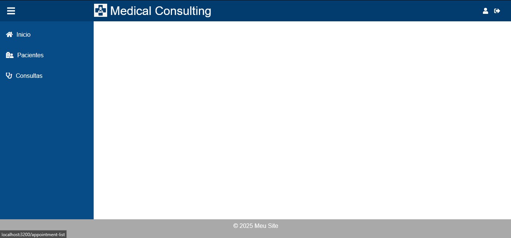
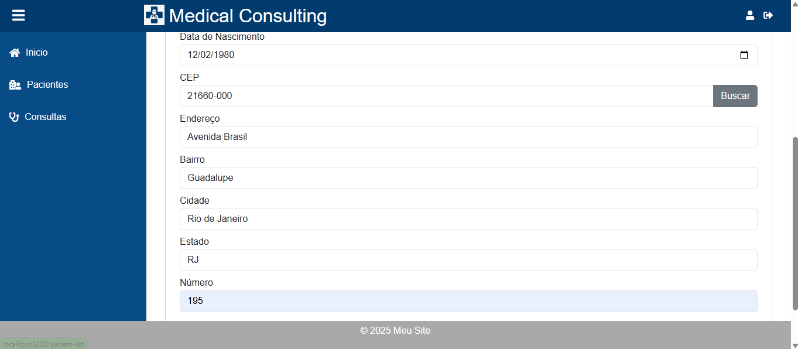
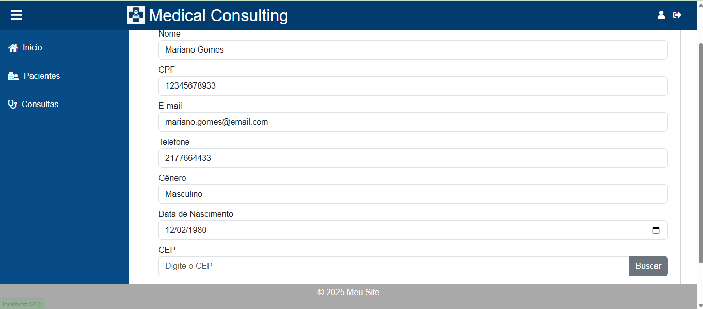
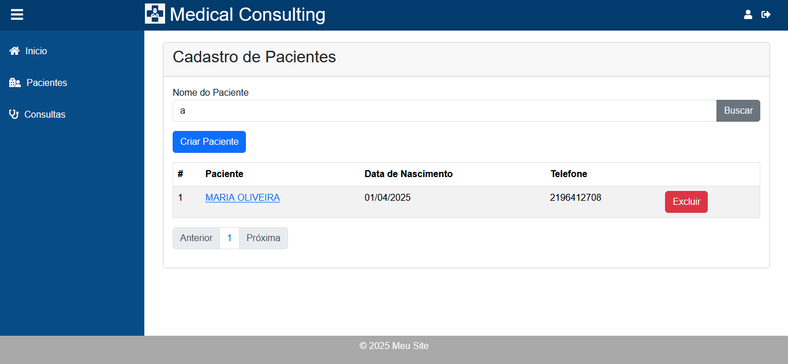
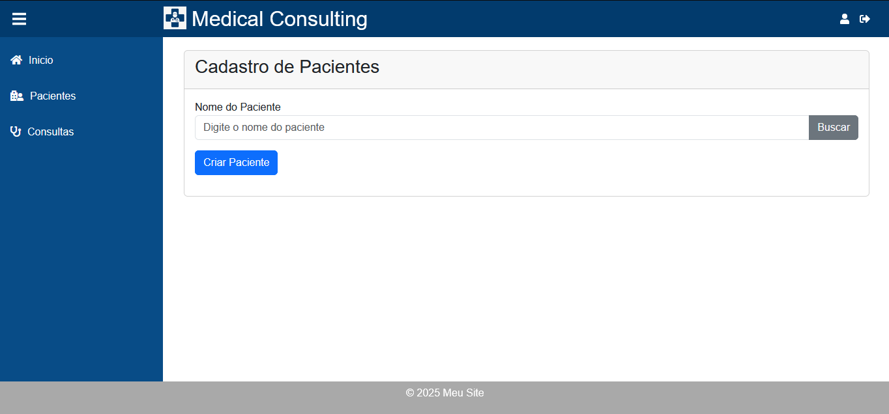
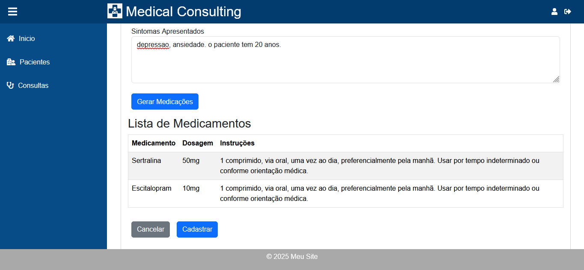
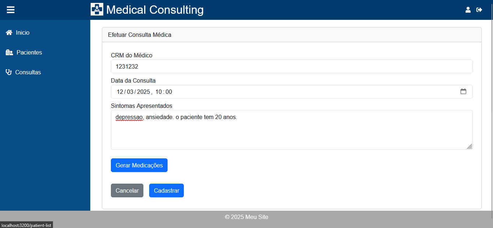
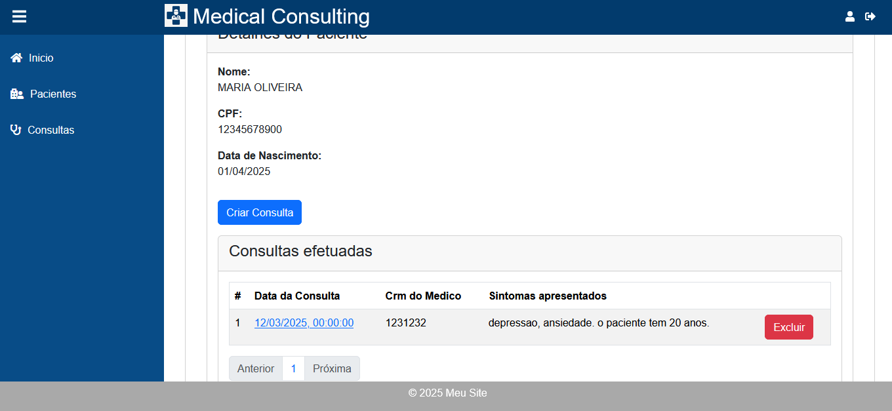
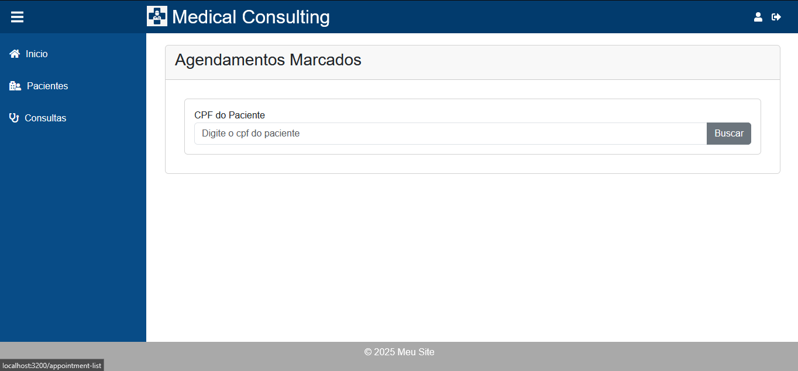

# Web Medical Consulting - Projeto MVP

Projeto MVP para disciplina **Desenvolvimento Back End Avançado** 

Este projeto é uma aplicação front-end desenvolvida com React. O objetivo é criar uma interface para gerenciar cadastro  de pacientes e de consultas, permitindo criar, editar, cancelar e visualizar informações.

## Funcionalidades

## Pré-requisitos

Para que a aplicação funcione corretamente, é necessário que tenha o node instalado e instale a aplicação com o comando:

```
npm install
```

- **Cadastro de Pacientes**: Funcionalidade para manter os dados de pacientes.
- **Consulta de Pacientes**: Funcionalidade que permite manter os dados de consultas de paciente, além de sugerir medicamentos utilizando iteligência artificial.


## Tecnologias Utilizadas

- **REACT**: React na versão 18.3.1
- **CSS**: Estilização da interface utilizando Bootstrap para um layout moderno e responsivo.
- **JavaScript**: Manipulação dinâmica da DOM e comunicação com a API via `fetch`.

## Como Executar
Assim que iniciar as aplicações backend, basta executar o comando abaixo:

```
npm start
```

## Rodando via Docker (Precisa ter o Docker Instalado)

Lembre-se de iniciar via docker as apis backend antes de iniciar a aplicação
front end.

```
docker build -t web--medical-consulting .
```

Para executar o container, rode o comando abaixo:

```
docker run --name web--medical-consulting \
    --network api-backend \  
    -p 3200:5000 \
    web--medical-consulting:latest
```

# Rodando via docker-compose

Configure a chave da api key do gemini no service api-apointment no docker-compose.yaml:

```
    environment:
        ...
      - GEMINI_TOKEN=<SUA API KEY>cker-compose
```

Para rodar via docker-compose, efetue um comando abaixo:

```
docker compose up
```

Este comando executa todas as aplicações. 

# Importante:

- É necessário que os projetos api--patient, api--appointment e bff--medical-consulting  estejam no mesmo diretório. 
- Não nenhum docker-compose nos projetos, para evitar conflito de portas do mysql e demais aplicações.


## Imagens da aplicação:

### Home


### Cadastro de Paciente





### Consulta de Paciente






## Autor
Clayton Morais de Oliveira
